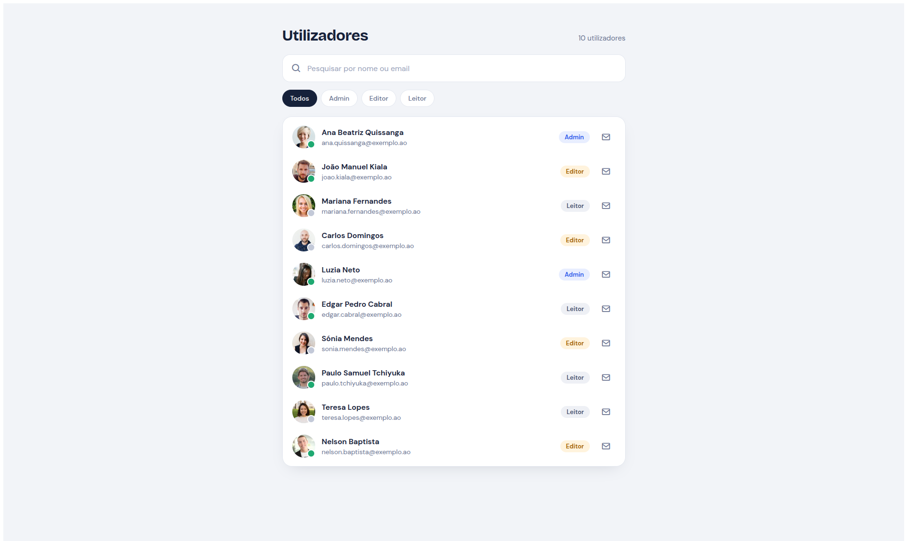

<h1 align="center">UserSearchApp</h1>

<p align="center">
  <strong>Modern Angular user management interface with search and role filtering</strong>
</p>

<p align="center">
  
  
  
  
</p>

<p align="center">
  
  
  
</p>

---

## Overview

**UserSearchApp** is a clean, modern, and responsive user management interface built with Angular. It enables users to instantly filter and search through records by name, email, or specific access roles.

---

## Features

- **Real-time Search:** Instant filtering by user name or email address.
- **Role Filtering:** Quick categorization filter (`Todos`, `Admin`, `Editor`, `Leitor`).
- **Modern Card Layout:** Clean user list layout featuring avatars and visual status badges.
- **Status Indicators:** Visual online/offline indicators for individual user accounts.
- **Responsive Design:** Optimized for different display sizes and viewports.

---

## Tech Stack

- **Framework:** Angular
- **Language:** TypeScript
- **Styling:** CSS / Modern UI components
- **Assets:** Custom UI badges and typography

---

## Getting Started

Follow the steps below to set up and run the project locally on your machine.

### Prerequisites

Ensure you have Node.js and the Angular CLI installed:
- [Node.js](https://nodejs.org/) (LTS version recommended)
- Angular CLI (`npm install -g @angular/cli`)

### Installation & Execution

1. Navigate to the project directory:
   ```bash
   cd www/frontend/user-search-app
   ```

2. Install dependencies:
   ```bash
   npm install
   ```

3. Start the development server:
   ```bash
   ng serve
   ```

4. Open your browser and navigate to:
   ```text
   http://localhost:4200/
   ```
   The application will automatically reload if you change any of the source files.

---

## Screenshots

<p align="center">
  
</p>

---

## Contributing

Contributions, issues, and feature requests are welcome! Feel free to check the issues page or submit a pull request.

---

## License

This project is licensed under the [MIT](LICENSE) License.